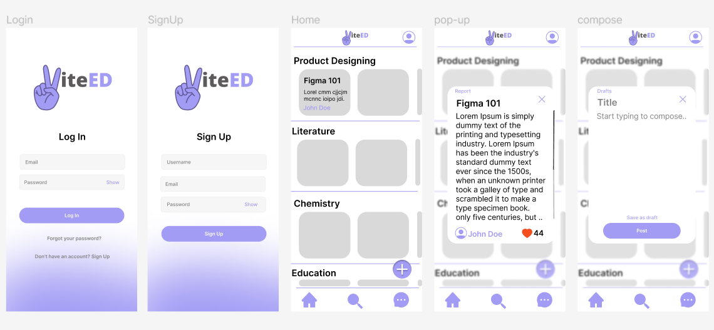

# viteED - a quick learning app
viteED is an open source learning application, currently under development. The application aims at providing users a platform to read or/and write mini blogs (<=100 words) on various range of topics. 

## Design
To know more about how this app will look, have a look at its proposed design. 

Have suggestions for the design? Create new design issue. 
To learn more about the design process and how the design was conceptualized, read [Design Process](/Documentation/Design_Process.md)

## Tech Stack
1. Flutter via dart
2. Appwrite as BaaS 

## Call for Contribution
Contribute to this project with your skill set. Since we started very recently, currently this app in it's basic phase with most of things un-done. 
Steps to contribute:
1. Create an issue on what you plan to add or show intent of contribution to an existing un-assigned issue.
2. Follow the discussion on the issue with other contributors 
3. Clone and develop. 
4. Test and Push the changes. 

We also look forward to develop viteED web-app. Contributions and suggestions are highly welcomed. 

## Database Structure 
Following is the structure of database that has been created using Appwrite. 

1. "posts" : [postid, username, title, datetime, content, topics, status(posted or draft?)]
2. "users" : [$id, topics[], name, profilepic]  
 

## Code of Conduct 
Review the [Code of Conduct](Code%20of%20Conduct.md)

## Feedback 
Any feedback would be appreciated. Create a new feedback issue. 
